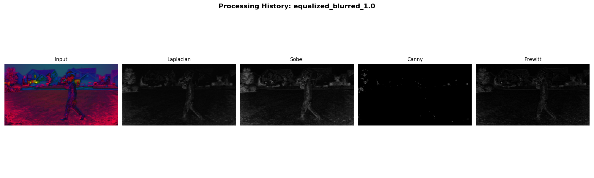
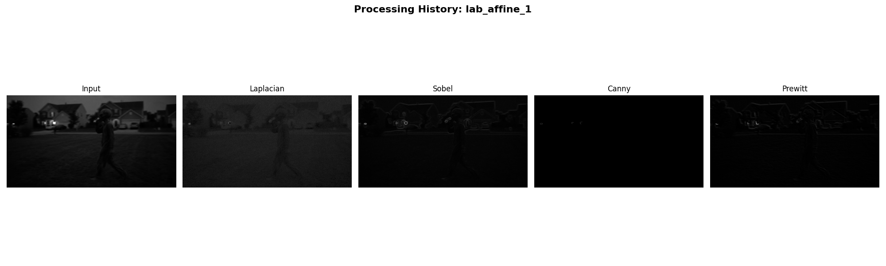
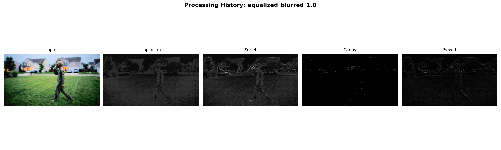
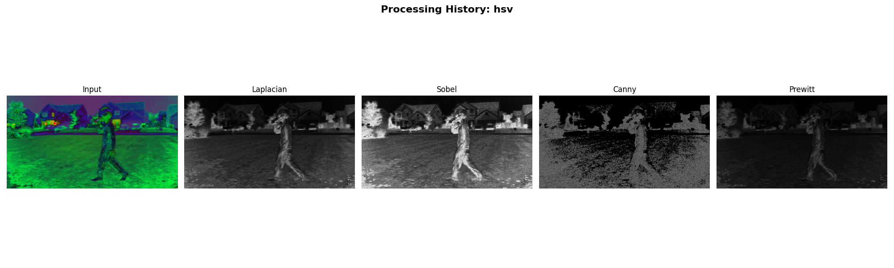
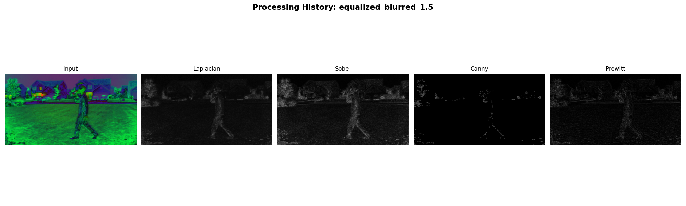
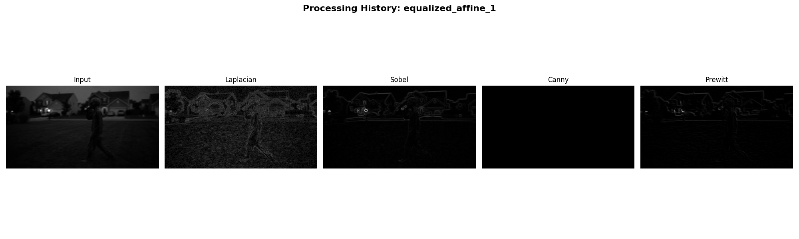

# CS898BA - HW 2

## Qualitative Analysis

Thresholding Methods (Otsu vs Adaptive)

Otsu's Thresholding: relies on a single global threshold and therefore struggles with different illumination across the foreground of the picture. It captures dense parts of the alien but it's highly succeptible to global shadow noise. 

Adaptive Thresholding: this method handled shadows much better, but it's highly sensitive to high-frequency textures and captured massive amounts of background noise from grass and leaves.

Color-Space Clustering (K-Means):
I tested K values between 3 and 5 and determined that 3 was opitmal because it captured the alien's entire body in a single cluster where other K values did not capture the entire alien. This method found the alien much better than thresholding methods. The drawback of this method is that it groups pixels purely by color instead of spatial awareness. That's why it grouped parts of the alien along with elements of the image which share the same color.

## Quantitative Analysis

A clean mask of the figure was created to serve as the ground truth. The algorithms were evaluated using the intersection over Union and Dice Coefficient

| Segmentation Method | Intersection over Union | Dice Coefficient |
|---------------------|-------------------------|------------------|
| Otsu's Thresholding | 0.0241 | 0.0471 |
| Adaptive Thresholding | 0.0587 | 0.1110 |
| K-Means Clustering (K=3) | 0.1078 | 0.1946 |

K-Means clustering is the highest performing method used according to IoU and Dice coefficients. However, all of the values are relatively low due to elements other than the figure itself being captured in the methods

## Visualizations

Below is the comparison of the preprocessing steps, the manual ground truth and the algorithmic segmentation masks

# CS898BA - HW 1

## Instructions

1. open project directory and create Python virtual environment
'python3 -m venv venv'

2. activate environment
'source venv/bin/activate (Mac) or '.\venv\Scripts\activate' (Windows)

3. install dependencies:
'pip install opencv-python numpy scipy matplotlib'

4. run scipt:
(making sure image is in directory)

## Gausian Blur

Applying a gausian blur before edge detection reduces noise. At higher sigmas, the picture smoothes out too much which causes missed edges. At lower sigmas, pictures are too noisy resulting in noise being picked up as an edge

## Edge Detection

Used 4 different algorithms on heavily modified pictures.

1. Sobel: best results, first derivative changes, provides clear boundaries resistant to small noise.
2. Prewitt: similar to sobel, without center weighting. Weaker edges, and more artifacts than sobel
3. Laplacian: Second derivative, too sensitive, chaotic edge maps if Gausian blur was not strong enoug
4. Canny: Highest computation cost. Provided continous, sharp outlines of objects on some of the images

## Plots

