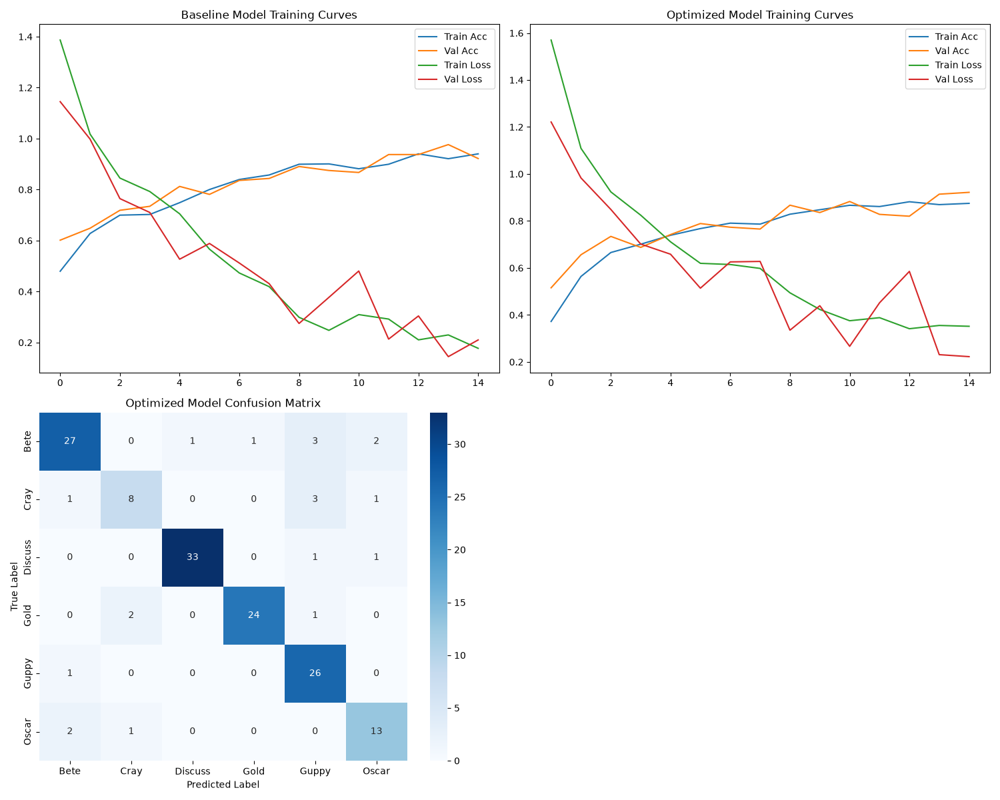

# CS898BA - HW 3

## Part 5: Evaluation and Analysis

### Qualitative Analysis

*   **Data Augmentation:** The implementation of random horizontal flips, minor rotations, and brightness adjustments prevented the baseline model from memorizing exact pixel layouts. Structural regularizer kept the training and validation curves tight, allowing the baseline model to achieve 90% accuracy without suffering from overfitting.

*   **Hyperparameter Tuning & Over-Regularization:** KerasTuner Random Search resulted in a performance drop, the "optimized" model fell to 86% accuracy. Because the fish dataset has 152 samples in the test split, introducing aggressive dropout (such as 0.5) causes the network to underfit slightly. If the random search selected a sub-optimal learning rate, it caused the model to settle in a local minimum rather than finding the true global optimal weights.

### Quantitative Comparison
The F1-Score represents the harmonic mean of precision and recall, calculated using the formula:

$$F_1 = 2 \cdot \frac{\text{Precision} \cdot \text{Recall}}{\text{Precision} + \text{Recall}}$$

#### Baseline Model Metrics (Learning Rate: 0.001, No Dropout)
*   **Overall Accuracy:** 90%
*   **Macro Precision:** 90%
*   **Macro Recall:** 87%
*   **Macro F1-Score:** 88%

#### Optimized Model Metrics (Tuner Selected Parameters)
*   **Overall Accuracy:** 86%
*   **Macro Precision:** 84%
*   **Macro Recall:** 84%
*   **Macro F1-Score:** 84%

### Per-Class Insights (Optimized Model)
Looking at the optimized model's breakdown, **Discus** was classified exceptionally well with an F1-score of 96% due to its unique round body shape and vibrant patterns. **Cray** proved to be the toughest class for the tuned model, a low 67% F1-score, its features were easily confused with other species under more aggressive regularization.

### Visualizations
The loss curves, accuracy paths, and the final multi-class confusion matrix are visualized in the composite graphic below:

